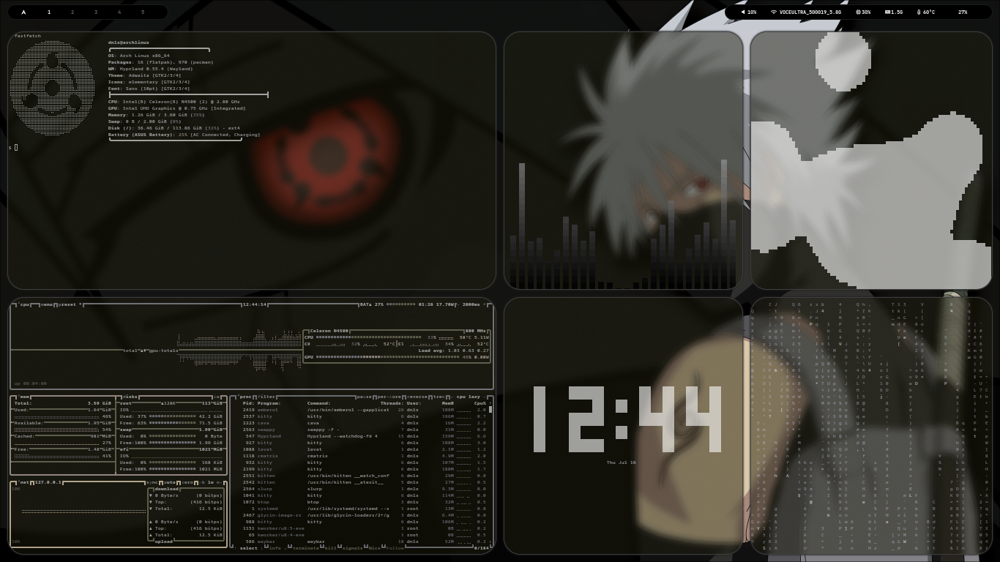
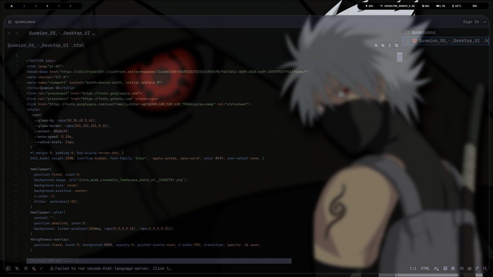

# dotfilericednlx


## programas para funcionar 100% sem erro
dependencias:
- hyprland
- waybar
- wofi
- kitty
- fastfetch
- swaybg
- pamixer
- cava
- nemo ou dolphin
- 





# coisas adicionais
- atalho para diminuir e aumenta o volume no hyprland.conf
- transparencia na maiorias do programas no hyprland.conf
- animaçoes na workspace e janelas
# distros
funciona perfeitamente em arch linux
mas em outras distribuiçoes precisam de ajuste antes


## Instalação

Clone o repositório:

```bash
git clone https://github.com/danielruan133-art/dotfilericesdnlx.git
cd dotfilesricednlx
cd dotfile
chmod +x install.sh
./install.sh

